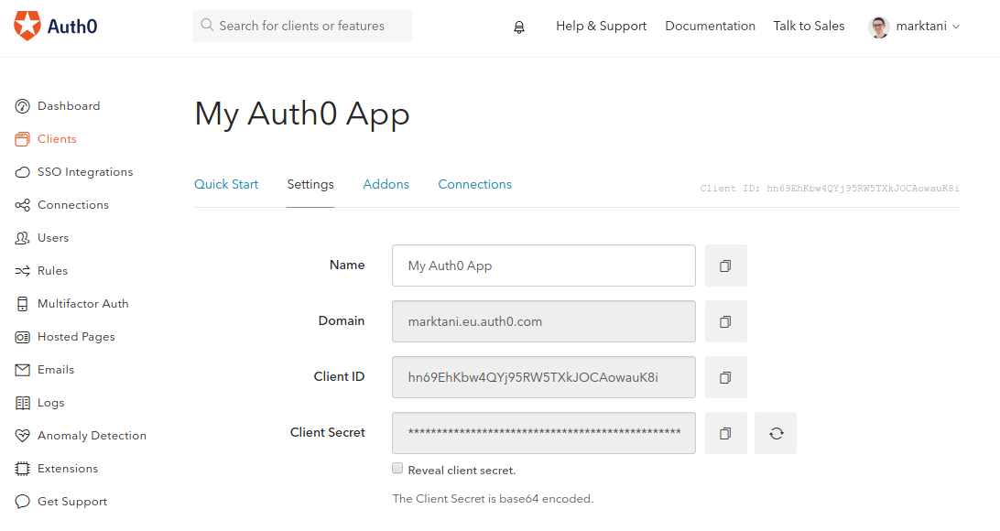
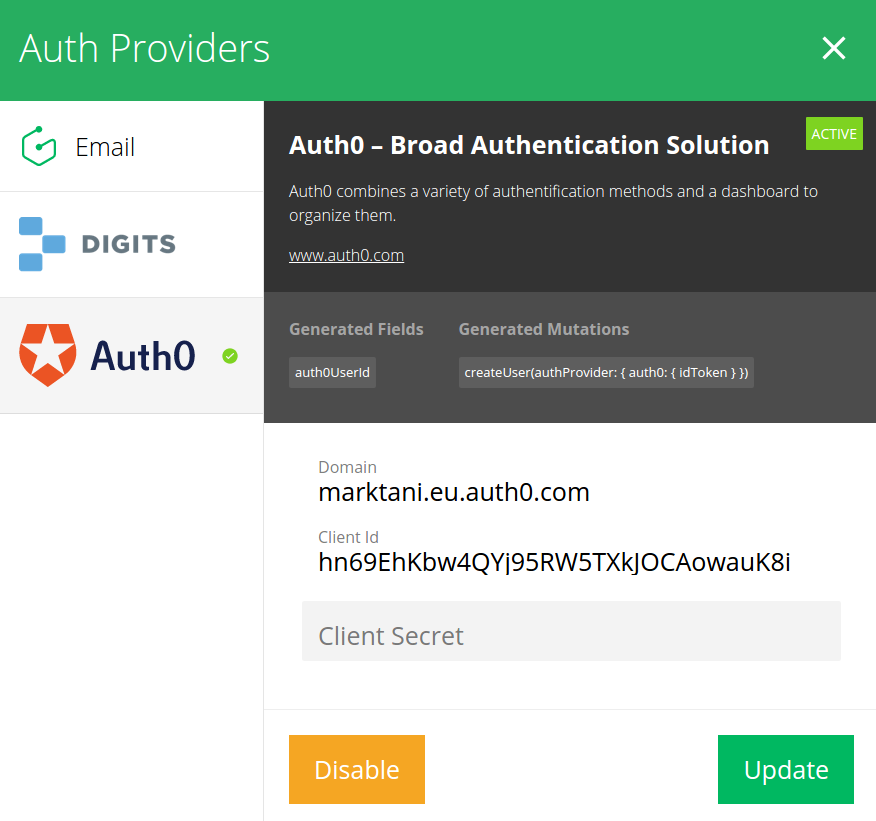

# Auth0 Integration

The [Auth0](https://auth0.com) integration ties in seamlessly with the [authentication](!alias-wejileech9) and [permission system](!alias-iegoo0heez).

## Collect the needed Credentials

In your Auth0 settings, create a new client or use an existing one. Copy the following parameters that you can find in the client settings:

* domain name
* client ID
* client secret

## Activate the Auth0 Integration

Enter the collected credentials in the Auth0 integration popup:

## Auth0 Lock

In your application, you can use [Auth0 Lock](https://auth0.com/lock) to offer a finished login experience.
